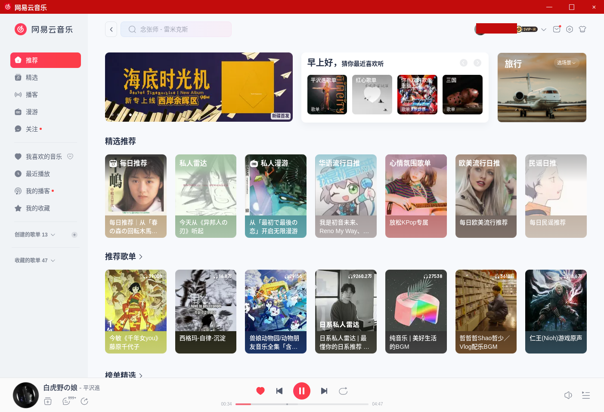
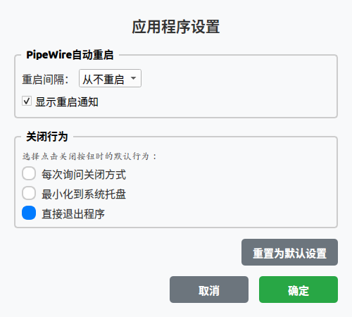

# 网易云音乐桌面版（Linux）

使用 PySide6 为[网易云音乐网页播放器](https://music.163.com/st/webplayer)打造的 Linux 桌面应用壳。

> **为什么只有 Linux？** Windows 和 macOS 都有网易云音乐官方客户端，唯独 Linux 没有——本项目就是来补这个缺口的。

## 界面预览





## 功能特性

- 🎵 **完整保留网页版播放器功能**：基于 QWebEngineView 嵌入官方网页版，播放、歌单、收藏、评论一应俱全
- 🖥️ **原生桌面窗口体验**：自定义标题栏 + 无边框窗口，支持八向边缘拖拽缩放
- 📌 **系统托盘集成**：最小化到托盘，托盘菜单支持显示/隐藏窗口、设置、退出
- 🔊 **PipeWire 音频守护**：自动检测 PipeWire 服务状态，异常时可从托盘一键重启
- 🔐 **登录状态持久化**：扫码登录一次，之后启动自动保持登录
- ⚙️ **关闭行为可配置**：关闭窗口时可选「最小化到托盘」或「直接退出」
- 📦 **AppImage 一键打包**：构建即所得，开箱即用

## 系统要求

- 操作系统：**Linux**（使用 systemd 与 PipeWire 的发行版体验最佳，如 Ubuntu 22.04+ / Fedora / Arch）
- Python 3.12+（源码运行时）
- 网络连接（需加载网易云音乐网页）

## 安装和运行

### 方式一：直接运行（开发）

```bash
# 安装依赖
pip install -r requirements.txt

# 运行
python main.py
```

项目使用 `uv` 管理虚拟环境的话，也可以：

```bash
uv run main.py
```

### 方式二：打包为 AppImage（分发）

```bash
bash packaging/scripts/build_appimage.sh
```

构建产物位于 `packaging/dish/`，生成后可脱离 Python 环境直接运行。

## 项目结构

```
NetEase_Cloud_Music_Web/
├── main.py                        # 程序入口
├── gui/                           # 界面模块
│   ├── main_window.py             # 主窗口（无边框 + WebView 容器）
│   ├── title_bar.py               # 自定义标题栏
│   ├── settings_dialog.py         # 设置对话框
│   ├── close_confirm_dialog.py    # 关闭确认对话框
│   └── window_resize.py           # 八向边缘缩放控制器
├── tray_manager.py                # 系统托盘
├── pipewire_manager.py            # PipeWire 服务检测与重启
├── pipewire_manager_integration.py# PipeWire 与托盘的集成
├── profile_manager.py             # 登录数据持久化（WebEngine Profile）
├── logger/                        # 日志系统
├── config/                        # 日志配置
├── icon/                          # 应用图标（多尺寸）
├── packaging/                     # PyInstaller + AppImage 打包
│   ├── NetEaseMusic.spec          # PyInstaller 规格文件
│   └── scripts/build_appimage.sh  # 一键构建脚本
└── screenshots/                   # README 界面截图
```

## 技术实现

- **PySide6 (Qt6)**：原生窗口、系统托盘、自定义标题栏
- **QWebEngineView**：嵌入网易云音乐网页播放器
- **QWebEngineProfile**：持久化保存登录 cookies 与站点数据
- **PipeWire / systemctl --user**：音频服务状态检测与自动重启
- **PyInstaller + appimage-builder**：AppImage 打包分发

## 登录状态说明

- 📱 扫码登录一次后，无需重复登录
- 💾 登录数据保存在本地用户目录的 WebEngine Profile 中
- 🔄 播放历史、收藏等数据由网易云音乐云端同步
- 🚫 不存储音频缓存等大文件，保持轻量化

## 注意事项

- 首次运行需要一些时间初始化 WebEngine
- 确保网络连接正常，应用内容依赖网易云音乐网页
- 音频播放依赖系统的 PipeWire 服务；如遇无声，可通过托盘菜单的「重启 PipeWire」恢复

## 许可证与声明

本项目仅为个人学习用途的第三方桌面壳，与网易公司无任何关联；音乐内容与网页服务版权归网易所有。
